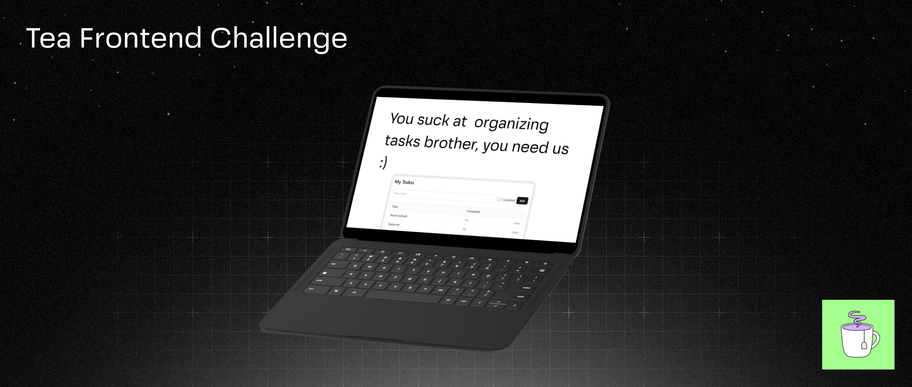

# 🧪 Frontend Take-Home Challenge – Next.js + Todo App

A small Todo application built with Next.js (App Router), React Query, and Shadcn UI. It uses DummyJSON for authentication and initial data hydration, and keeps subsequent CRUD changes consistent via a persistent, file-backed store on the server.

## Requirements implemented

- Login with DummyJSON (`/auth/login`) using credentials from the docs
- Token stored as HttpOnly cookie (hidden from client JS)
- Protected area under `/todos` (server-side guard in layout)
- Todos list with pagination (state persisted in URL)
- Todo details page with edit and delete
- Create, update, delete todos
- UI consistency despite DummyJSON not persisting writes
  - React Query optimistic updates on the client
  - Persistent server store so subsequent reads reflect changes

## Tech stack

- Next.js App Router, TypeScript, TailwindCSS, Shadcn UI
- @tanstack/react-query (+ Devtools)
- Native `fetch` only

## Architecture overview

- Auth
  - `POST /api/auth/login` proxies to `https://dummyjson.com/auth/login` and sets an HttpOnly cookie from `accessToken` (or `token`).
  - `GET /api/auth/me` returns the current user based on token.
  - `POST /api/auth/logout` clears the cookie.
- Protected routes
  - `app/(protected)/layout.tsx` checks the auth cookie and redirects to `/login` if missing.
- Todos: server-side persistent store
  - First read per user hydrates from DummyJSON into a JSON file under `.data/todos.json`.
  - All reads/writes afterward go to this file-backed store, so the UI remains consistent across refreshes and navigation.
  - Routes:
    - `GET /api/todos?page=&limit=` → returns a paginated slice from the store
    - `POST /api/todos` → creates in the store
    - `GET /api/todos/[id]` → reads from the store
    - `PUT /api/todos/[id]` → updates in the store
    - `DELETE /api/todos/[id]` → deletes in the store

## Why a persistent store?

DummyJSON’s write operations (POST, PUT, DELETE) do not actually change the remote data. To keep the UI correct after refresh or navigation, an internal persistent store is used. We combine that with React Query’s optimistic updates for instant feedback and fast interactions.

Store location:

- `src/lib/server/store/todosStore.ts`
- Data file: `.data/todos.json` (created automatically)

> Note: This is designed for a single-process demo (local dev / take‑home). It is not intended for multi-instance deployments.

## Running locally

```bash
# install deps
npm i

# dev
npm run dev
```

Open http://localhost:3000

Login credentials (from DummyJSON docs):

- username: `emilys`
- password: `emilyspass`

## Key files

- App shell:
  - `src/app/layout.tsx`
  - `src/app/(protected)/layout.tsx`
- Auth routes:
  - `src/app/api/auth/login/route.ts`
  - `src/app/api/auth/me/route.ts`
  - `src/app/api/auth/logout/route.ts`
- Todos routes:
  - `src/app/api/todos/route.ts`
  - `src/app/api/todos/[id]/route.ts`
- Store:
  - `src/lib/server/store/todosStore.ts`
- Pages:
  - `src/app/login/page.tsx`
  - `src/app/(protected)/todos/page.tsx`
  - `src/app/(protected)/todos/[id]/page.tsx`

## UI

Shadcn-like primitives (button, input, card) are used for a clean baseline. React Query Devtools are enabled in development.

## Notes on the hero image

- The README references the image via a relative path: `public/take-home-fe-challenge-hero.png`, which renders on GitHub.
- Keeping the image in `public/` is fine, but if you prefer to avoid serving it at runtime (since it’s README-only), you can move it to `docs/assets/` and update the README link to `docs/assets/take-home-fe-challenge-hero.png`.

## References

- DummyJSON Auth: https://dummyjson.com/docs/auth

---

Made for the Tea Frontend Challenge. Good luck reviewing! 🍵
